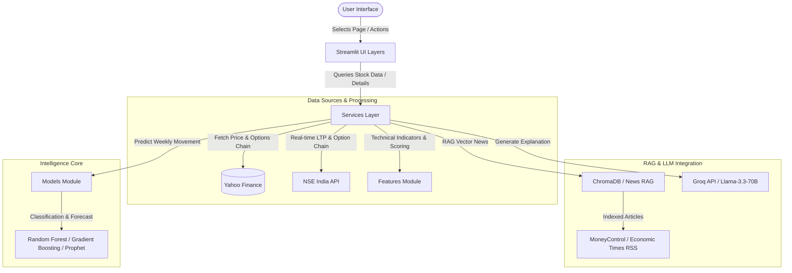
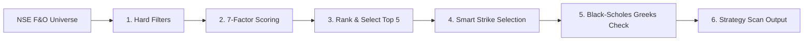

# 📈 AI Stock Assistant (NSE/BSE) Repository Analysis

This document provides a detailed walkthrough of the AI Stock Assistant codebase. It outlines the system architecture, core functionality, component maps, and technical details of the features and trading strategies implemented.

---

## 🎯 Architecture Overview

The application is structured as a **modular Streamlit web application** designed to help traders analyze equities, scan for short-term momentum, execute options strategies, and manage portfolio risk. It integrates technical analysis indicators, machine learning ensembles (Random Forest + Gradient Boosting), and time-series forecasting (Prophet) with Large Language Models (LLMs via Groq) and Retrieval-Augmented Generation (RAG via ChromaDB).

### Data & Execution Flow Diagram

---

## 📁 Repository Directory Structure

The codebase is cleanly separated into responsibilities:

*   [app.py](file:///Users/nvvsnarayanadasari/StockMarket/stock_ai_assistant/app.py) — Main application entry point. Sets configurations and loads the Streamlit page layout/styling.
*   [config/](file:///Users/nvvsnarayanadasari/StockMarket/stock_ai_assistant/config) — Empty package marker.
*   [data/](file:///Users/nvvsnarayanadasari/StockMarket/stock_ai_assistant/data) — Local JSON stores ([stock_master.json](file:///Users/nvvsnarayanadasari/StockMarket/stock_ai_assistant/data/stock_master.json) and [fno_master.json](file:///Users/nvvsnarayanadasari/StockMarket/stock_ai_assistant/data/fno_master.json)) caching the universe definitions.
*   [features/](file:///Users/nvvsnarayanadasari/StockMarket/stock_ai_assistant/features) — High-performance indicators extraction, custom technical scoring cards, and ticker dropdown mappings.
*   [models/](file:///Users/nvvsnarayanadasari/StockMarket/stock_ai_assistant/models) — Machine learning ensemble predictions, volatility range estimations, and Prophet forecasting engines.
*   [rag/](file:///Users/nvvsnarayanadasari/StockMarket/stock_ai_assistant/rag) — Chroma vector database and embedding pipelines to query and store RSS feed market headlines.
*   [scripts/](file:///Users/nvvsnarayanadasari/StockMarket/stock_ai_assistant/scripts) — Standalone administration scripts to refresh local files.
*   [services/](file:///Users/nvvsnarayanadasari/StockMarket/stock_ai_assistant/services) — Core business-logic controllers, options pricing algorithms, live APIs, and LLM prompts.
*   [ui/](file:///Users/nvvsnarayanadasari/StockMarket/stock_ai_assistant/ui) — Interactive visual layouts, charts, and metrics for each functional panel.
*   [utils/](file:///Users/nvvsnarayanadasari/StockMarket/stock_ai_assistant/utils) — Global configurations loader and Loguru logging wrapper.

---

## ⚙️ Core Components Details

### 1. Data Enrichment & Caching Scripts
Before running the dashboard, the universe files are generated and cached locally by scraping authority lists from NSE and BSE:
*   [refresh_stock_master.py](file:///Users/nvvsnarayanadasari/StockMarket/stock_ai_assistant/scripts/refresh_stock_master.py): Queries live equity CSV files from the National Stock Exchange (NSE) and BSE APIs, normalizes name structures, and writes [stock_master.json](file:///Users/nvvsnarayanadasari/StockMarket/stock_ai_assistant/data/stock_master.json).
*   [refresh_fno_master.py](file:///Users/nvvsnarayanadasari/StockMarket/stock_ai_assistant/scripts/refresh_fno_master.py): Fetches the list of active derivatives stocks. Pulls lot sizes from the official NSE derivatives archives, maps symbols, and stores entries in [fno_master.json](file:///Users/nvvsnarayanadasari/StockMarket/stock_ai_assistant/data/fno_master.json).

### 2. Feature Engineering & Technical Analysis
The [indicators.py](file:///Users/nvvsnarayanadasari/StockMarket/stock_ai_assistant/features/indicators.py) file computes key math indicators on pandas OHLCV dataframes using the `ta` library:
*   **Moving Averages**: 20-day, 50-day, and 200-day Simple Moving Averages.
*   **Momentum & Volatility**: RSI (14), MACD (including signals and histogram), Average True Range (ATR_14), and Bollinger Bands width (BB_WIDTH).
*   **Intraday Approximations**: Computes volume-weighted average price (VWAP) and flags volume anomalies (Volume > 1.5× 20-day average).

The [scoring.py](file:///Users/nvvsnarayanadasari/StockMarket/stock_ai_assistant/features/scoring.py) file computes a **Stock Scorecard** (0 to 10 scale) based on trend alignment, momentum zones (RSI 55–70, positive MACD), volume spikes, and relative Bollinger band expansion.

### 3. Forecasting & Machine Learning Core
The weekly price predictions and bounds are generated by [prediction_models.py](file:///Users/nvvsnarayanadasari/StockMarket/stock_ai_assistant/models/prediction_models.py):
*   **Trend Direction (ML Ensemble)**: Trains a `RandomForestClassifier` and a `GradientBoostingClassifier` on historical 5-day forward return labels. Predicts whether the next week's close will be *Bullish*, *Bearish*, or *Sideways* along with a probability value.
*   **Price Range Projections**: Combines an ATR/Historical Volatility range formula with a Prophet time series prediction model (if available) to project expected high/low bounds for the next 5 sessions.

### 4. Vector Database & News RAG
The [news_rag_service.py](file:///Users/nvvsnarayanadasari/StockMarket/stock_ai_assistant/rag/news_rag_service.py) file indexes general stock market RSS feeds (MoneyControl, Economic Times) into a local ChromaDB collection using the `sentence-transformers/all-MiniLM-L6-v2` embeddings model.
It returns relevant news summaries for stock symbols by cascading through:
1.  Real-time Yahoo Finance news (via `yf.Ticker(symbol).news`).
2.  ChromaDB vector query fallback.
3.  Regex/keyword-based RSS text search fallback.

---

## 📈 Functional UI Pages

### 📈 Stock Analysis Page
*   **File**: [stock_analysis_page.py](file:///Users/nvvsnarayanadasari/StockMarket/stock_ai_assistant/ui/stock_analysis_page.py)
*   **Features**:
    *   Provides a search dropdown powered by the stock master.
    *   Draws interactive Plotly Candlestick charts overlaid with Bollinger Bands, VWAP, moving averages, and volume bars.
    *   Generates an **AI explanation and verdict** using the Llama-3.3-70B model via Groq by providing the technical scorecard, indicators, and recent news context.

### ⚡ Intraday Scanner Page
*   **File**: [intraday_scanner_page.py](file:///Users/nvvsnarayanadasari/StockMarket/stock_ai_assistant/ui/intraday_scanner_page.py)
*   **Features**:
    *   Scans the Nifty 50, 100, or 200 universes.
    *   Computes scores based on RSI levels, volume spikes, and VWAP breakouts.
    *   Provides ATR-based short-term profit potential range forecasts.
    *   Analyzes **Sector Rotation** (ranking sectors by 5-day average returns).

### 🧺 Portfolio Advisor Page
*   **File**: [portfolio_advisor_page.py](file:///Users/nvvsnarayanadasari/StockMarket/stock_ai_assistant/ui/portfolio_advisor_page.py)
*   **Features**:
    *   Accepts user position input: average buy price and holding quantity.
    *   Cross-references current prices to generate metrics: unrealized P&L %, absolute value change, and risk-reward ratios.
    *   Implements a rule-based advisor ([portfolio_service.py](file:///Users/nvvsnarayanadasari/StockMarket/stock_ai_assistant/services/portfolio_service.py)) yielding explicit actions like **HOLD**, **SELL** (profit-booking), or **REDUCE / EXIT** (stop-loss protection).
    *   Utilizes the LLM to format custom positioning and accumulation plans.

---

## 📊 F&O Call Buying Strategy (Deep-Dive)

The repository implements a specific options strategy described in [NSE_FO_Call_Buying_Strategy_Advanced.md](file:///Users/nvvsnarayanadasari/StockMarket/stock_ai_assistant/NSE_FO_Call_Buying_Strategy_Advanced.md). The main backend implementation resides in [options_service.py](file:///Users/nvvsnarayanadasari/StockMarket/stock_ai_assistant/services/options_service.py) with the UI presented in [options_scanner_page.py](file:///Users/nvvsnarayanadasari/StockMarket/stock_ai_assistant/ui/options_scanner_page.py).

### Strategy Execution Flow

### The 6 Layers of the Strategy

1.  **Hard Filters (Pre-Qualification)**
    A stock must satisfy all parameters before it is evaluated:
    *   *Trend*: Current price must be above its 20-day moving average.
    *   *Volume Expansion*: Today's volume must be at least **1.2×** the 20-day average.
    *   *Volatility Check*: ATR(14) / Price must be $\ge 1.5\%$.
    *   *Overextended Cap*: 3-day price gain must not exceed $8\%$ (prevents buying at swing highs).
    *   *IV Filter*: Proxy IV Rank (Historical Volatility vs. 52-week high/low range) must sit between $25\%$ and $65\%$.

2.  **Indicator Normalization (7-Factor Scoring)**
    Passed stocks are scored on a normalized $0\text{--}100$ scale:
    *   **A. Momentum (25% weight)**: Based on 5-day percentage change.
    *   **B. Breakout (15% weight)**: 100 if Close > 10-day highest high, else 0.
    *   **C. Volume Expansion (15% weight)**: Scaled ratio of current volume vs 20-day average.
    *   **D. OI Long Buildup (15% weight)**: Since live Open Interest (OI) is not directly exposed by the basic APIs, the system uses a **price-increase + volume-increase proxy** to estimate long positions.
    *   **E. RSI Zone (10% weight)**: Favors standard momentum accumulation zones (RSI between 45–65 scores 100).
    *   **F. IV Sweet Spot (10% weight)**: Incentivizes purchase when IV Rank is between 30–60.
    *   **G. Nifty Alignment (10% weight)**: 100 if NIFTY50 index is trading above its 20 DMA.
    *   *Enhancement (Relative Strength)*: Adds +5 bonus points if stock's 10-day return outpaces the NIFTY50.

3.  **Top-N Selection**
    Stocks are ranked by the composite score; only the top performing candidates are selected (standard strategy looks at the top 5).

4.  **Smart Contract Selection**
    Determines which strike to purchase using a deterministic 3-rule heuristic:
    *   *Aggressive*: If Momentum Score > 75 and Volume Ratio > 1.8, select **OTM +1** strike (expecting high momentum run).
    *   *Conservative*: If IV Rank > 60, select **ITM -1** strike (deeper intrinsic value cushion protects against potential volatility crush).
    *   *Balanced (Default)*: Select **ATM** strike (balanced Delta).

5.  **Greeks Verification (Black-Scholes Engine)**
    Calculates Black-Scholes greeks for the chosen contract:
    *   *Delta Constraint*: Checks if delta falls in the target $0.40\text{--}0.55$ sweet spot.
    *   *Theta Constraint*: Checks if the daily theta loss is $\le 0.5\%$ of the total option premium.
    *   *Reward/Risk Estimation*: Calculates R/R ratio:
        $$\text{Reward} = \text{Target Price Move} \times \text{Delta}$$
        $$\text{Risk} = \text{Option Premium} \times 0.30 \text{ (30\% Stop Loss)}$$
        Checks if the ratio is $\ge 1.8$.
    
    > [!NOTE]
    > Greeks and constraints are displayed as advisory flags in the UI and are not hard exclusions.

6.  **Exit Signals & Automation**
    The app displays real-time warning indicators for the open contracts:
    *   Stock closes below its 5-day Exponential Moving Average (EMA).
    *   The stock's Momentum Score falls below 50.
    *   Option contract value drops 30% (Stop Loss reached).
    *   5 trading days have completed.

---

## 🛠️ Key Technical Strengths

*   **NSE LTP Fetching Cascade**: To obtain option contract prices, the code first queries the live NSE quote endpoint (`https://www.nseindia.com/api/quote-derivative`). If blocked or after market hours, it seamlessly falls back to querying the cached option chain via `yfinance` (.NS tickers).
*   **NSE Session Cookie Warming**: Implements a robust 3-step cookie chain warming procedure (fetching index, derivatives page, and master-quote) to keep the requests authenticated.
*   **Asynchronous Processing**: The options scanner processes the 200+ F&O stocks concurrently using a `ThreadPoolExecutor` to speed up scans.
